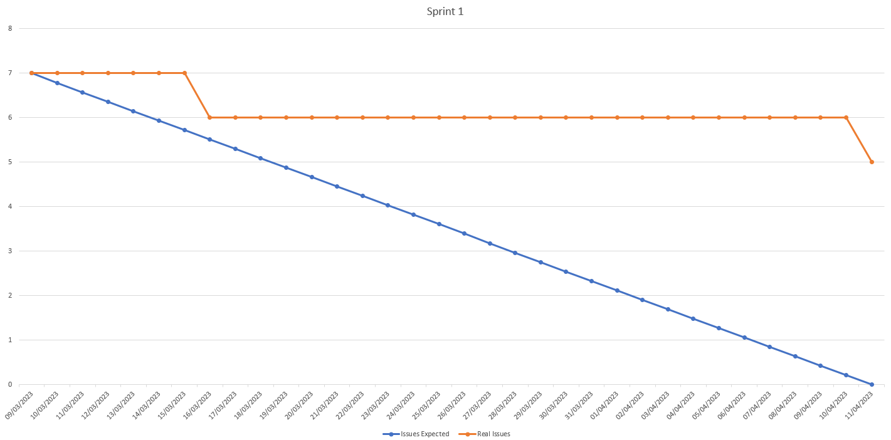
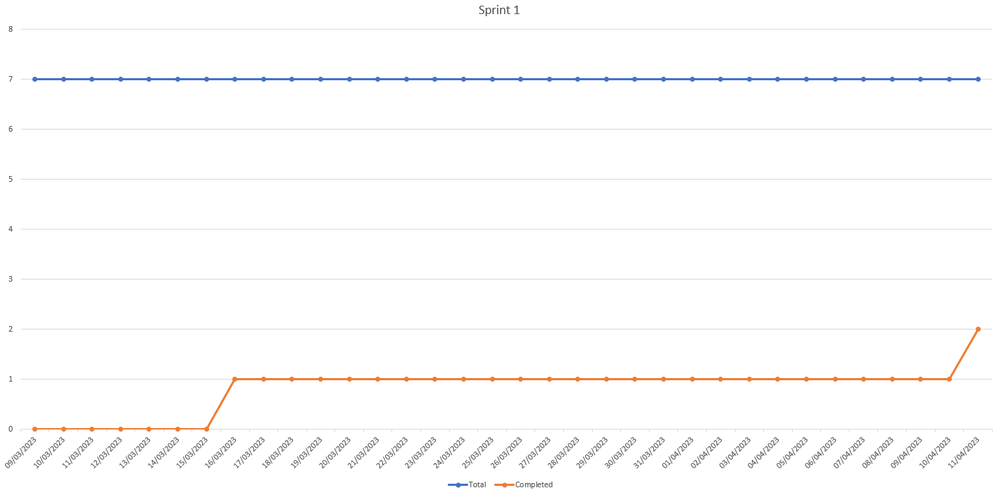

# Sprint Review Title (DD-MM-YYYY)

## Work Scheduled/Performed

| Action | Brief Description | Completed |
|--------|-------------------|-----------|
|        |                   | [Yes/No]  |

## Burn-down Graph

*Here we need an image reflecting the advances in the Burn-down graph. Complementing the image, we need a small
paragraph describing the Scrum Master opinion about the advances.*

Como podemos observar en la gráfica, el equipo ha realizado el primer trabajo en poco tiempo, mientras que en el segundo
el hecho de completarlo ha sido más costoso.

Scrum Master: "El equipo ha realizado un buen trabajo, pero debería haberse organizado mejor para poder realizar el
trabajo de forma más eficiente. Debido a que el ultimo 'issue' no se hubiera retrasado debido a los examenes."

## Brun-up (Velocity) Graph

*Here we need an image reflecting the advances in the Burn-up graph. Complementing the image, we need a small paragraph
describing the Scrum Master opinion about the advances.*

Como podemos observar en la gráfica, el equipo ha realizado el primer trabajo en poco tiempo, mientras que en el segundo
el hecho de completarlo ha sido más costoso.

Scrum Marste:"Podemos observar que el numero total de 'issues' totales no varia mucho, lo que indica solo estan
definiendo el trabajo a realizar en el inicio del sprint."

## Client Improvements

For the conclusions we need to reflect improvement points reflected by our customer.

| Client Improvement | Description                                                                                                                  |  
|--------------------|------------------------------------------------------------------------------------------------------------------------------|
| Modificació Títols | S'hauria de canviar els titols per evitar confusions (hores tècnics -> disponibilitat tècnics, tècnics -> llista de tècnics) |
| Funció de Borrar   | La funció de borrar no borrarà en la base de dades, sinó que modificarem si es actiu o no per aixi tenir el històric         |
| Modificacions      | Obtenir algún mètode per saber la darrera modificació d'un element                                                           |
