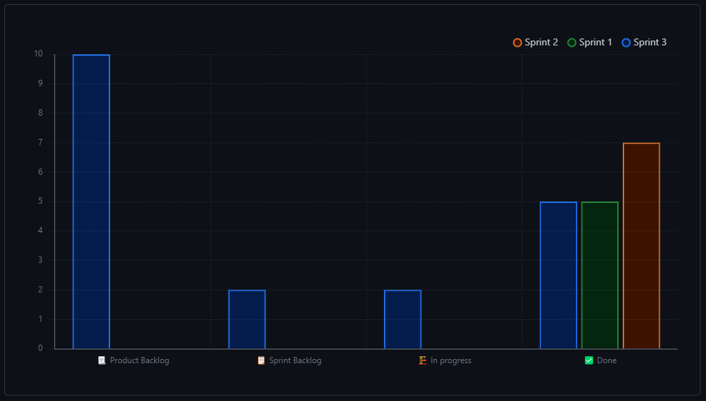
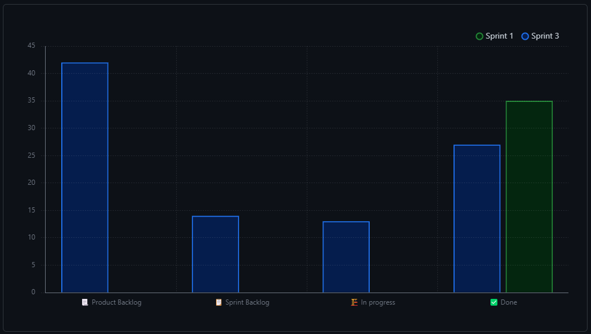

# Sprint Review 23-05-2023

## Work Scheduled/Performed

| Action | Brief Description | Completed |
|--------|-------------------|-----------|
|        |                   | [Yes/No]  |

## Burn-down Graph

*Here we need an image reflecting the advances in the Burn-down graph. Complementing the image, we need a small
paragraph describing the Scrum Master opinion about the advances.*

Como podemos observar en la gráfica "status chart" obtenido desde Git, el equipo ha realizado el trabajo, mientras que en el segundo
el hecho de completarlo ha sido más costoso.

Scrum Master: "El equipo ha realizado un buen trabajo, pero debería haberse organizado mejor para poder realizar el
trabajo de forma más eficiente."

## Brun-up (Velocity) Graph

*Here we need an image reflecting the advances in the Burn-up graph. Complementing the image, we need a small paragraph
describing the Scrum Master opinion about the advances.*

En este grafico "velocity" no detecta el sprint que corresponde al segundo sprint desde Git.

Scrum Master:"Podemos observar que el numero total de 'issues' totales es superior al del sprint anterior."

## Client Improvements

For the conclusions we need to reflect improvement points reflected by our customer.

| Client Improvement | Description                                                                                                          |  
|--------------------|----------------------------------------------------------------------------------------------------------------------|
| Funció de Borrar   | La funció de borrar no borrarà en la base de dades, sinó que modificarem si es actiu o no per aixi tenir el històric |
| Modificacions      | Obtenir algún mètode per saber la darrera modificació d'un element                                                   |
| Confirmació        | Insertar una confirmació a l'hora de esborrar algun elements. Tenir el compte "Funció de Borrar".                    |