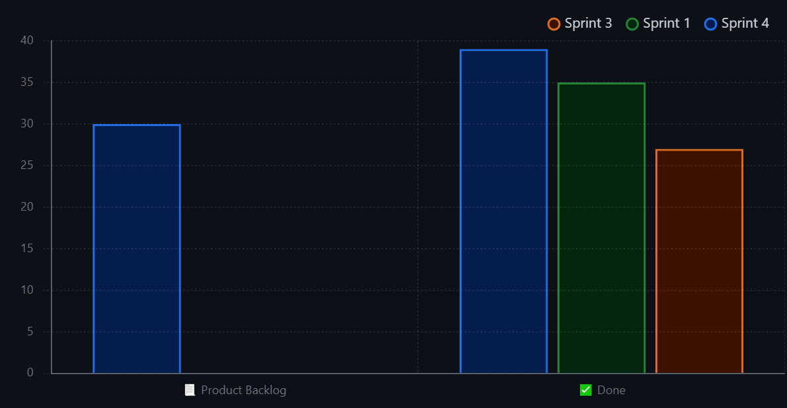

# Sprint Review Title: DD-MM-YYYY

## Work Scheduled/Performed

| Action                                 | Brief Description                                                                                                             | Completed |
|----------------------------------------|-------------------------------------------------------------------------------------------------------------------------------|-----------|
| Guardar ticket i enviar una copia      | Com a client, m’agradaria guardar el ticket elaborat anteriorment i enviar una copia al departament Comercial i de Facturació | Yes       |
| Visualitzar sol·licituds d'assistència | Com a tècnic especialista, m’agradaria poder veure les sol·licituds d’assistència per part de l’empresa.                      | Yes       |
| Elaborar ticket                        | El client ha de poder elaborar un ticket per a demanar ajuda al departament Comercial i de Facturació                         | Yes       |
| Emmagatzemar factures                  | El client ha de poder emmagatzemar les factures rebudes                                                                       | Yes       |
| Perfil tècnics especialistes           | El tècnic especialista ha de poder accedir al sistema amb un perfil propi                                                     | Yes       |
| Informe material defectuós             | El tècnic ha de poder realitzar un informe d'on queda constància el material que està defectuós                               | Yes       |
| Revisar pressupost                     | El client ha de poder revisar el pressupost que ha elaborat el departament comercial                                          | No        |
| Omplenar formulari                     | El tècnic especialista ha de poder omplenar un formulari amb les dades de la sessió realitzada                                | No        |

## Burn-down Graph

*Here we need an image reflecting the advances in the Burn-down graph. Complementing the image, we need a small
paragraph describing the Scrum Master opinion about the advances.*

Como podemos observar en la gráfica "status chart" obtenido desde Git, el equipo ha realizado el trabajo propuesto en un inicio y ha completado muchas de las tascas que se debían realizar y automatizar. Aunque el desarroyo ha sido positivo, han quedado tascas a realizar en el product backlog.

Scrum Master: "El equipo ha realizado un buen trabajo, pero debería haberse organizado mejor para poder realizar el
trabajo de forma más eficiente y así lograr hacer todas las tascas previstas."

## Brun-up (Velocity) Graph

*Here we need an image reflecting the advances in the Burn-up graph. Complementing the image, we need a small paragraph
describing the Scrum Master opinion about the advances.*

[IMAGE GOES HERE]

[DESCRIPTION GOES HERE]

## Client Improvements

For the conclusions we need to reflect improvement points reflected by our customer.

| Client Improvement           | Description      |  
|------------------------------|------------------|
| Client Improvement Action 1  | Task Description |  
| Client Improvement Action 2  | Task Description | 
| Client Improvement Action 3  | Task Description | 