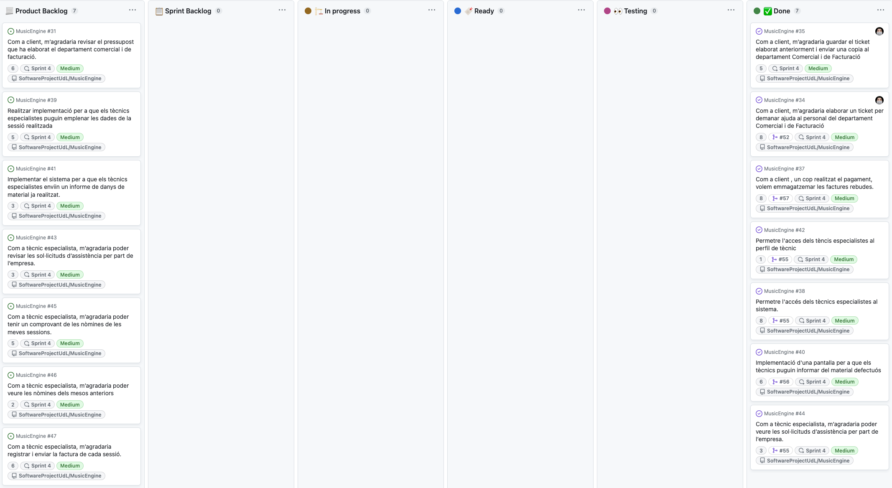

# Sprint Planing Title: 24-05-2023

| Assistant        | Role                          |  
|------------------|-------------------------------|
| Gerard Monso     | Developer and Project Manager | 
| Andreu Perez     | Developer and Requirements    |
| Hector del Egido | Requirements and Developer    |  
| Joel Rozados     | Requirements and Quality      | 
| Marc Bustos      | Quality and Developer         |
| Guillem Mora     | Project Manager and Developer |

## Spring Planing Overview

Considering the proposed distribution in the model Kanban, the overall activities to be performed by the team are:

| Team Member      | Overall Task Description                                                                                     |  
|------------------|--------------------------------------------------------------------------------------------------------------|
| Project Managers | Elaborar el model Kanban.                                                                                    |
| Project Managers | Informar a Music Engine d'un prototip de les millores abans d'implementar una versió elaborada i definitiva. |
| Developers       | Implementar el perfil dels tècnics especialistes.                                                            |
| Developers       | Permetre l'accés dels tècnics especialistes al sistema.                                                      |
| Developers       | Implementar que un tècnic pugui enviar un informe al acabar una sessió.                                      |
| Developers       | Oferir un registre de l'històric de nòmines dels tècnics.                                                    |   
| Developers       | Funció d'elaboració d'un tiquet per part del client.                                                         |   
| Developers       | Oferir un registre amb totes les sessions assistides pels clients.                                           |
| Developers       | Implementar que un tècnic pugui indicar la seva disponibilitat.                                              |
| Requeriments     | Dur a terme un anàlisis de riscos.                                                                           |
| Quality          | Realitzar els testos per comprobar la viabilitat de les funcions desenvolupades pels developers.             |   
| Quality          | Realitzar les review activities per comprobar la viabilitat de les funcions desenvolupadres pels developers. |   

